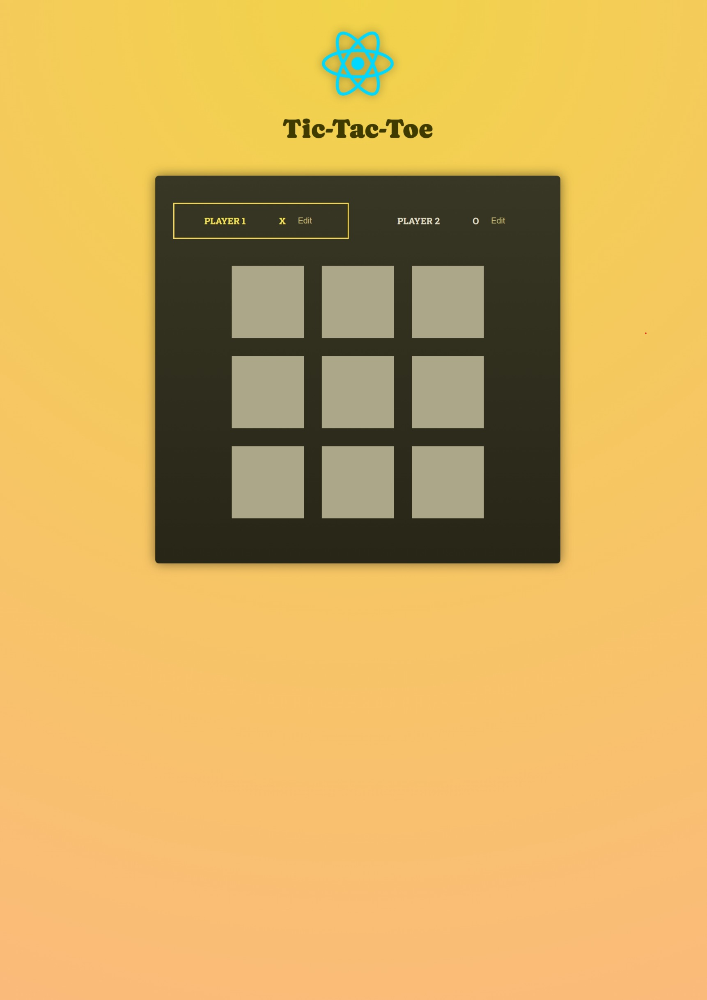
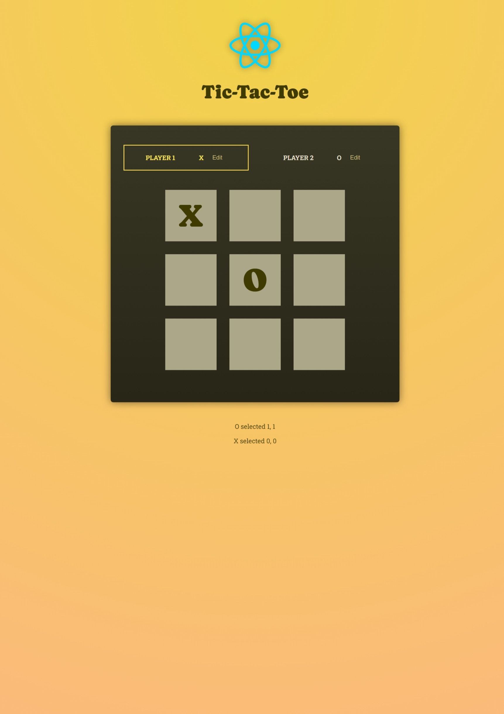
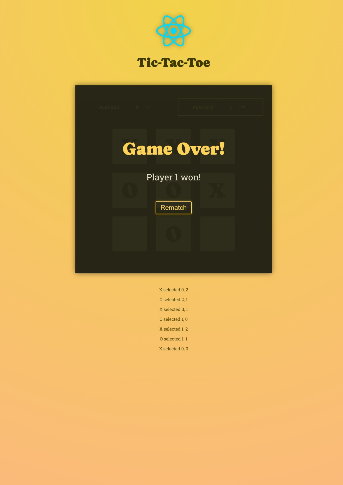

### Tic Tac Toe Application

Project based on **React.js** & **Typescript**, lets users play **Tic Tac Toe**.

### Pre Requisites

- **Node.js** version **21** or greater.

### Dependencies used by the project

1. **react**.
2. **react-dom**.

### Dev Dependencies used by the project

1. **vite**.
2. **typescript**.

### Instructions

1. Run `npm run dev` command to run the project.

1. Visit `http://localhost:5173/`, this will open the home page that looks like this. 

1. Enter the name of the players and start playing the game. 

1. Only one player will win. 
